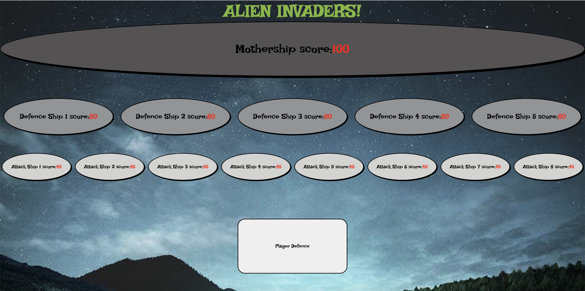

# Hostile Aliens Project

## Description

Hostile Aliens is a game I created as part of the advanced Javascript module of my web development course at _nology.

The game is loosely based on the classic 'space invaders', however has a much simpler format due to the focus being on implementing object oriented programming, pure functions and test driven development which I recently studied on the course.

## How to play

There are 3 ship types - attack ships, defence ships and the mother ships. Clicking on the 'player defence' button will shoot a random ship, each of which will lose a certain amount of points depending on its ship type.

The game is over once all of the ships are destroyed.

## Future additions

In future, in order to make the game more enjoyable, I'd like to introduce a timer and alien fire functionality or some 'asteroids', which reduce a player score upon impact.

## How it looks
